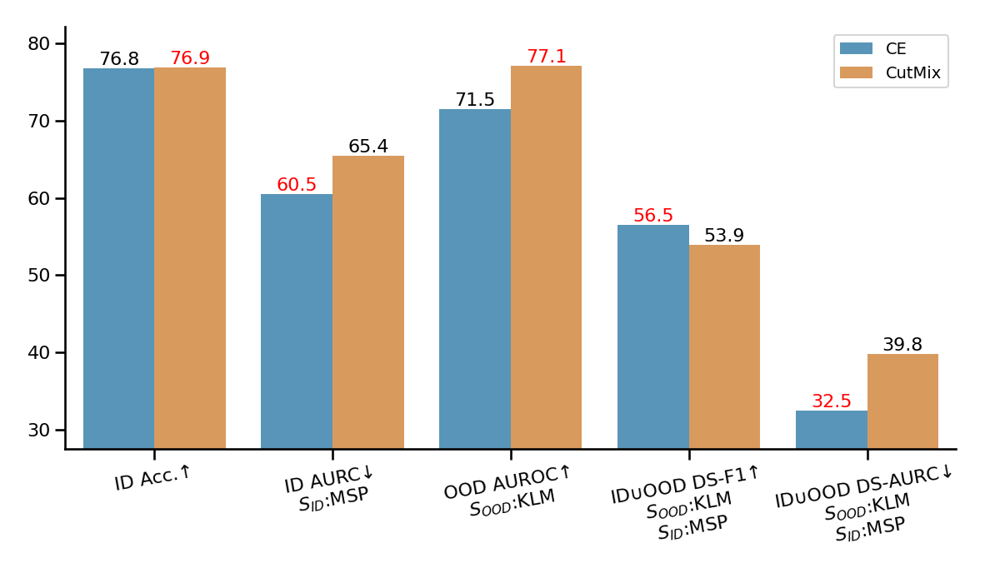
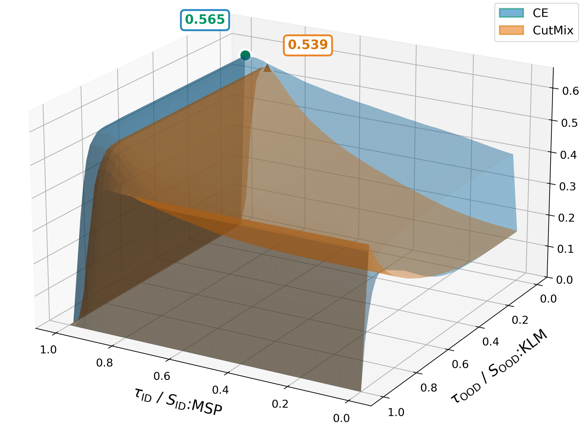
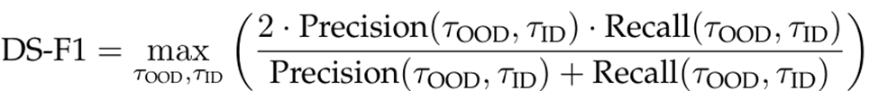
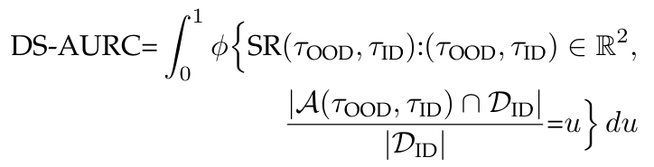
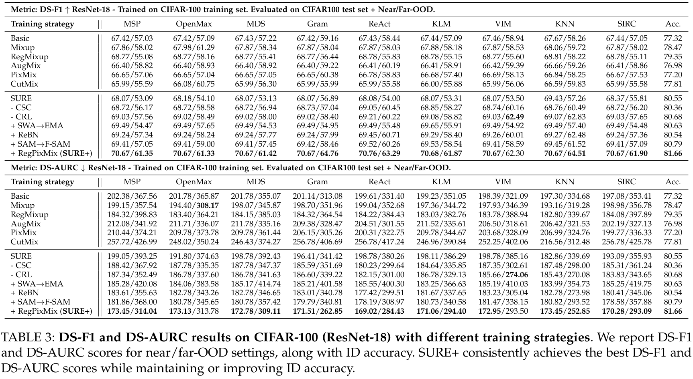
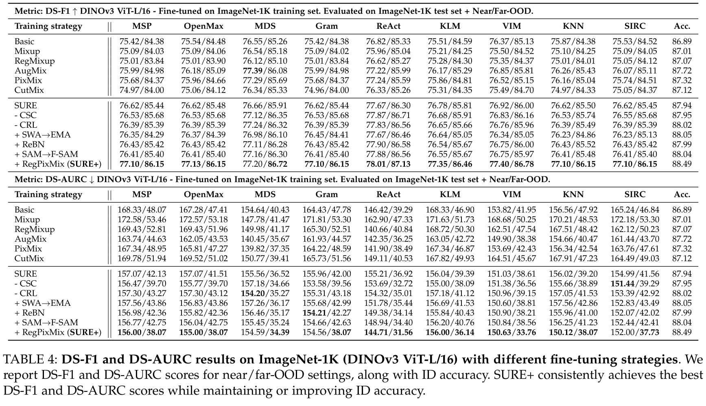

<div align="center">

# From Misclassifications to Outliers: Joint Reliability Assessment in Classification

[](https://arxiv.org/abs/2603.03903)
[](https://liyangggggg.github.io/SUREPlus_project/)
[](LICENSE)
[](https://www.python.org/)
[](https://pytorch.org/)

</div>

Official PyTorch implementation of the paper **"From Misclassifications to Outliers: Joint Reliability Assessment in Classification"**.

---

## 📋 Table of Contents

- [Overview](#-overview)
- [Motivation](#-motivation-the-limitations-of-single-score)
- [Double Scoring Metrics](#-double-scoring-metrics)
- [SURE+ Training Strategy](#-sure-training-strategy)
- [Installation](#-installation)
- [Data Preparation](#-data-preparation)
- [Pretrained Models](#-pretrained-models)
- [Training](#-training)
- [Evaluation](#-evaluation)
- [Results](#-results)
- [Citation](#-citation)
- [License](#-license)
- [Acknowledgements](#-acknowledgements)

---

## 🎯 Overview

Existing approaches typically treat **misclassification detection** and **OOD detection** as separate problems. This repository provides a **unified framework** for reliability assessment that:

* **Jointly addresses selective risk and OOD detection** within a single pipeline
* **Supports both training and evaluation**
* **Implements our proposed DS Metrics** for reliability analysis

The framework is compatible with **ResNet-18** and **DINOv3 (ViT-L/16)** and integrates with **[OpenOOD](https://github.com/Jingkang50/OpenOOD)** for standardized benchmarking.

---

## 🔍 Motivation: The Limitations of Single Score

Existing approaches typically treat **misclassification detection** and **out-of-distribution (OOD) detection** as separate problems. They optimize for either ID accuracy or OOD detection, but not both jointly. This leads to:
- Poor trade-offs between classification accuracy and reliability
- Incomplete evaluation of model reliability
- Suboptimal performance in real-world deployment scenarios

<p align="center">
  
  
</p>

 Comparison between Cross-Entropy (CE) and CutMix training strategies across multiple metrics. While CutMix improves OOD detection (OOD AUROC), it shows lower performance in joint reliability assessment (DS-F1) compared to CE.
<p align="center">
  
</p>
3D visualization of DS-F1 scores as a function of ID threshold (τ_ID) and OOD threshold (τ_OOD). The surface shows that CE achieves a higher maximum DS-F1 score (0.565) compared to CutMix (0.539).

---

## 📊 Double Scoring Metrics

We propose **Double Scoring (DS) metrics** — including **DS-F1** and **DS-AURC** — that simultaneously evaluate a model's ability to identify misclassifications and detect OOD samples within a unified framework.

### DS-F1 (Double Scoring F1 Score)

DS-F1 extends the traditional F1 score to jointly consider both misclassification detection and OOD detection:

<p align="center">
  
</p>


### DS-AURC (Double Scoring Area Under Risk-Coverage Curve)

DS-AURC extends the selective classification risk-coverage framework to incorporate OOD detection:

<p align="center">
  
</p>

More details see paper.

---

## 🚀 SURE+ Training Strategy

We propose **SURE+**, a comprehensive training strategy that combines four key components to achieve state-of-the-art reliability performance:

| Component | Description |
|-----------|-------------|
| **RegMixup** | Regularized mixup augmentation for improved calibration and robustness |
| **RegPixMix** | Regularized pixel-level mixup that preserves semantic information |
| **F-SAM** | Fisher information guided Sharpness-Aware Minimization |
| **EMA (ReBN)** | Exponential Moving Average with Re-Batch Normalization |

---

## 🛠️ Installation

### Prerequisites

- Python >= 3.10
- PyTorch >= 2.0
- CUDA >= 11.4

### Setup

```bash
# Clone the repository
git clone https://github.com/Intellindust-AI-Lab/SUREPlus.git
cd SUREPlus

# Create virtual environment
conda create -n sure_plus python=3.10
conda activate sure_plus

# Install dependencies
pip install -r requirements.txt

# For CUDA 12.4 (recommended)
pip install torch==2.4.0 torchvision==0.19.0 --index-url https://download.pytorch.org/whl/cu124
```

---

## 📁 Data Preparation

For instructions on downloading and preparing the dataset, please refer to the official guide from **[OpenOOD](https://github.com/Jingkang50/OpenOOD)**.

### PixMix Dataset

Download [PixMix](https://github.com/andyzoujm/pixmix) augmentation images.

### Training Dataset Structure

Organize your datasets in ImageFolder format:

```
/path/to/dataset/
├── train/
│   ├── class_001/
│   │   ├── img_001.jpg
│   │   └── ...
│   └── ...
└── val/
    ├── class_001/
    └── ...
```

---

## 🔥 Pretrained Models

We provide [pretrained checkpoints](https://drive.google.com/drive/folders/17GZPbCy9jeh6gClaztYPJzPSKEu5XZHn?dmr=1&ec=wgc-drive-%5Bmodule%5D-goto) for SURE+

### DINOv3 Setup

For DINOv3, download the official pretrained weights from [Meta AI](https://ai.meta.com/resources/models-and-libraries/dinov3-downloads/):

```bash
# Set paths in your training scripts
--dinov3-path /path/to/dinov3_vitl16.pth \
--dinov3-repo /path/to/dinov3
```

---

## 🚀 Training

Training scripts are located in `run/train/`. We support both single-GPU and multi-GPU (DDP) training.

### Quick Start

#### ResNet-18 on CIFAR-100 (SURE+)

```bash
python main.py \
  --gpu 0 \
  --lr 0.05 \
  --batch-size 128 \
  --epochs 200 \
  --model-name resnet18 \
  --optim-name fsam \
  --pixmix-weight 1.0 \
  --regmixup-weight 1.0 \
  --rebn \
  --pixmix-path ./PixMixSet/fractals_and_fvis/first_layers_resized256_onevis/ \
  --save-dir ./checkpoints/ResNet18-Cifar100/SURE+ \
  Cifar100
```

Or use the provided script:
```bash
bash run/train/resnet18/SURE+.sh
```

#### DINOv3-L/16 on ImageNet-1K (SURE+)

```bash
python main.py \
  --gpu 0 1 2 3 4 5 6 \
  --lr 1e-5 \
  --weight-decay 5e-6 \
  --batch-size 64 \
  --epochs 20 \
  --model-name dinov3_l16 \
  --optim-name fsam \
  --pixmix-weight 1.0 \
  --mixup-weight 1.0 \
  --mixup-beta 10.0 \
  --rebn \
  --dinov3-repo ./dinov3 \
  --dinov3-path ./dinov3/dinov3_vitl16_pretrain.pth \
  --save-dir ./checkpoints/DinoV3_L16-ImageNet1k/SURE+ \
  ImageNet1k
```

Or use the provided script:
```bash
bash run/train/dinov3/SURE+.sh
```

---

## 📊 Evaluation

Testing scripts are in `run/test/` and are fully compatible with **OpenOOD**.

### Evaluation Workflow

1. **Baseline Evaluation**: Save raw logits
2. **Post-processing**: Apply various OOD detectors

### Supported Post-processors

Post-processors follow the implementations in **[OpenOOD](https://github.com/Jingkang50/OpenOOD)**. In addition, this repository includes the **SIRC** post-processor. By default, MSP is used as the ID confidence score.

### Quick Evaluation

```bash
# Evaluate ResNet-18 on CIFAR-100
bash run/test/resnet18/test.sh
```

### Custom Evaluation

```bash
export CUDA_VISIBLE_DEVICES=0

PYTHONPATH='.':$PYTHONPATH \
python openood/main.py \
  --config openood/configs/datasets/cifar100/cifar100.yml \
  openood/configs/datasets/cifar100/cifar100_ood.yml \
  openood/configs/networks/resnet18_32x32.yml \
  openood/configs/pipelines/test/test_ood.yml \
  openood/configs/preprocessors/base_preprocessor.yml \
  openood/configs/postprocessors/msp.yml \
  --network.checkpoint "./checkpoints/ResNet18-Cifar100/SURE+/best_1.pth" \
  --network.name resnet18_32x32 \
  --output_dir "./results/SURE+"
```

### Cosine Classifier Models

For CSC models, use the appropriate network config:

```bash
--network.name resnet18_32x32_csc  # For ResNet-18
--network.name dinov3_l_csc        # For DINOv3
```

---

## 🏆 Results

### ResNet-18 on CIFAR-100

<p align="center">
  
</p>

### DINOv3 on ImageNet-1K

<p align="center">
  
</p>


*More results available in the [paper](https://arxiv.org/abs/2603.03903).*

---

## 📁 Project Structure

```
SURE-plus/
├── 📄 main.py                  # Main training entry point
├── 📄 train.py                 # Training loop implementation
├── 📁 model/                   # Model definitions
│   ├── resnet18.py            # ResNet-18 backbone
│   ├── classifier.py          # Cosine classifier
│   └── get_model.py           # Model factory
├── 📁 data/                    # Data loading utilities
│   ├── dataset.py             # Dataset and DataLoader
│   └── sampler.py             # Custom samplers
├── 📁 utils/                   # Utility functions
│   ├── option.py              # Argument parser
│   ├── optim.py               # Optimizers & schedulers
│   ├── ema.py                 # Exponential moving average
│   ├── sam.py / fsam.py       # SAM implementations
│   ├── valid.py               # Validation metrics
│   └── utils.py               # Helper functions
├── 📁 openood/                 # OpenOOD integration
│   ├── configs/               # Dataset & model configs
│   └── main.py                # OpenOOD evaluation
├── 📁 run/                     # Training & testing scripts
│   ├── train/                 # Training scripts
│   └── test/                  # Testing scripts
├── 📄 requirements.txt         # Python dependencies
└── 📄 README.md               # This file
```

---

## 📝 Citation

If you find this work useful, please consider citing:

```bibtex
@article{li2026from,
  title={From Misclassifications to Outliers: Joint Reliability Assessment in Classification},
  author={Li, Yang and Sha, Youyang and Wang, Yinzhi and Hospedales, Timothy and Hu, Shell Xu and Shen, Xi and Yu, Xuanlong},
  journal={arXiv preprint arXiv:2603.03903},
  year={2026}
}
```

---

## 📄 License

This project is licensed under the MIT License - see the [LICENSE](LICENSE) file for details.

---

## 🙏 Acknowledgements

This work builds upon the following excellent open-source projects:

- **[OpenOOD](https://github.com/Jingkang50/OpenOOD)** - OOD detection benchmark
- **[DINOv3](https://github.com/facebookresearch/dinov3)** - Self-supervised vision transformer

We thank the authors for sharing their high-quality code and pretrained models.

---

<div align="center">

⭐ Star us on GitHub — it motivates us a lot!

</div>
